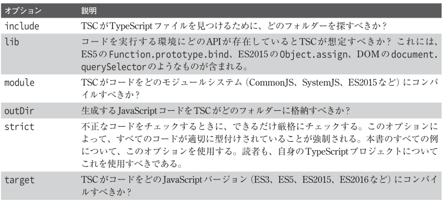

# NITech-Community_server
NITech-Community server
今のコードは練習に使う。後に、書き直し可能性がある。

# 22/08/16
## ESLint
リントまたリンターとは、コンピュータプログラムなどのソースコードを読み込んで内容を分析し、問題点を指摘してくれる静的解析ツール。また、そのようなツールで解析を行うこと。 ツールを指す場合は “linter” （リンター）と呼ぶこともある。

ESLintはJavaScriptのリンターですが、TypeScript用のプラグインを使うことで、TypeScriptのリンターとしても使えるようになっている。

### ESLintの新規導入
ESLintによるリントの設定は、JavaScript、JSON、またはYAMLの形式で.eslintrc.*というファ
イルに記述する。

このほか、コマンドラインから任意の設定ファイルの名前を指定することもできるし、package.
jsonファイルのeslintConfigフィールドに設定を記述することもできる。

```terminal
npm i -D eslint @typescript-eslint/eslint-plugin @typescript-eslint/parser
```

eslintパッケージはESLintのパッケージで、@typescript-eslint/eslint-pluginパッケー
ジはESLintのTypeScript用プラグインです。また、@typescript-eslint/parserパッケージは、
TypeScriptをESLintが理解できるようパースする役割を担うものです。

## tsconfig
各オプション及びその意味

